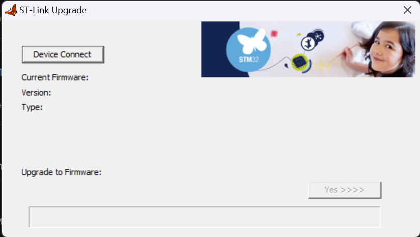
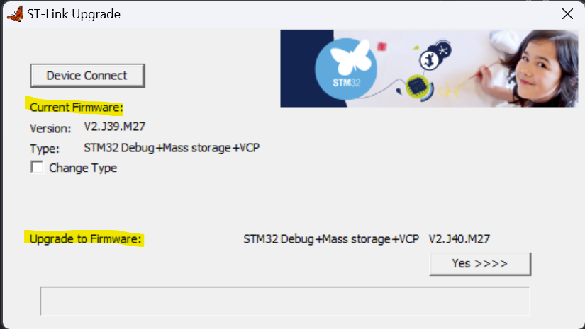
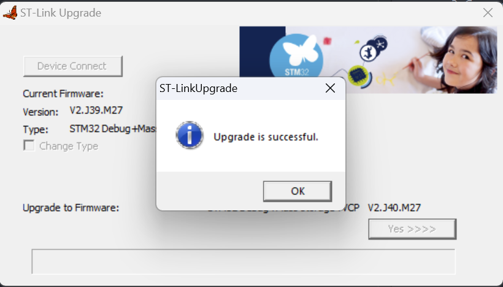

# STM32 Board Firmware Upgrade

## Requirement
- STM32 board
- STSW-LINK007 software

## Steps
1. Download and install STSW-LINK007 from [ST.com Website](https://www.st.com/en/development-tools/stsw-link007.html). You might need to register for account to access the files.
2. Open the STSW-LINK007 program.
   
    

3. Connect your STM32 board to the PC using USB cable.
4. Press the **Device Connect**
5. Check if the if the firmware update is available by comparing the current firmware version and the update firmware version

    

6. Click **Yes>>>>** to upgrade the firmware.
7. Once the upgrade is successful, close the program.
   
    